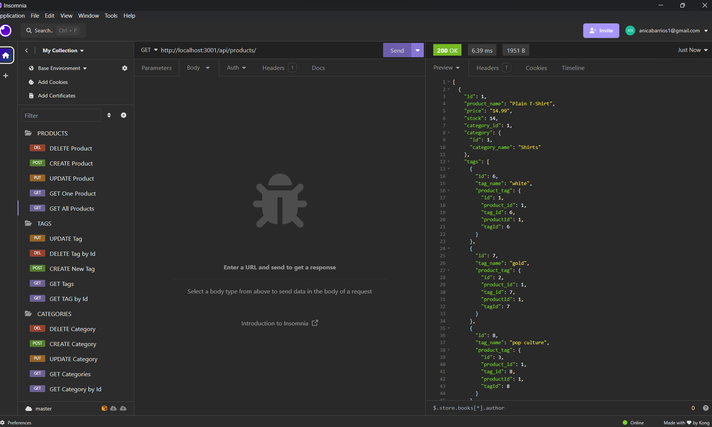

# E-Commerce-Backend


The challenge is to build the back end for an e-commerce site.

## Table Of Content
* [General Info](#general-info)
* [Technologies](#technologies)
* [Installation](#installation)
* [Usage](#usage)
* [License](#license)

## General Info
We took a working Express.js API and configured it to use Sequelize to interact with a MySQL database. This application won’t be deployed so i’ll show a walkthrough video that demonstrates its functionality.<br>
Image showcasing the application running in Insomnia.<br>


Demonstration Video <br>
[Link to the video](https://www.loom.com/share/77dbe7747a4c4c908b7a2736448a3550?sid=20c7b775-bbfe-40f7-9330-2a36306b9fdc)

## Technologies
Project is created with 
* [Javascript](https://www.javascript.com/)
* [Node.js](https://nodejs.org/en/)
* [Sequelize](https://www.npmjs.com/package/sequelize)
* [MySQL2](https://www.npmjs.com/package/mysql2)
* [Express](https://www.npmjs.com/package/express)
* [Dotenv](https://www.npmjs.com/package/dotenv)

## Installation
Install dependencies 
```terminal
npm init -y
``` 
```terminal
npm install express sequelize mysql2
```
Open up MySQL shell and input 
```terminal
source db/schema.sql
```
Then quit MySQL shell and input the following in your terminal
```terminal
npm run seed
```
to start running application simply input 
```terminal
node server.js
```
Open up Insomnia core to GET, POST, PUT and DELETE from different routes.

## Usage
The application is used to GET data for each route(categories, products, or tags) as well as create, update, and delete data in those routes.

## License
[](https://opensource.org/licenses/MIT)
<br>
This repository is licensed under the MIT license.